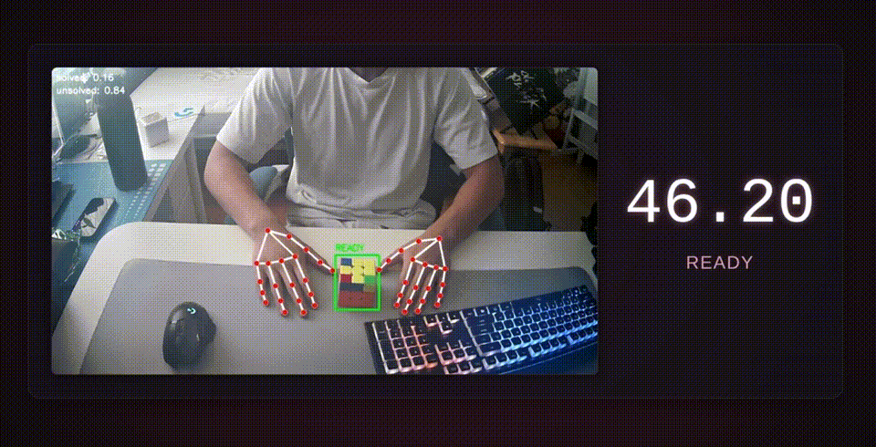

# nntimer

a smart, hands-free speedcube timer powered by computer vision.

   

---

## features

- **automatic timer:** starts and stops automatically by watching your hands and the cube.
- **hand tracking:** uses mediapipe to know when your hands are on or off the cube.
- **smart cube detection:** a two-stage model first finds the cube (yolov8) and then classifies its state (resnet18) for higher accuracy.
- **web interface:** a sleek, modern ui to see the video feed and your solve times.
- **highly tunable:** easily tweak sensitivity parameters at the top of `main.py` to match your style.

## how it works

the timer runs a python backend using fastapi and opencv. it serves a simple html/css/js frontend that displays the video stream.

1.  **yolov8 (onnx):** a fast object detector finds the cube in the frame.
2.  **resnet18 (pytorch):** a cnn classifies the cropped image of the cube as 'solved' or 'unsolved'.
3.  **mediapipe:** tracks hand landmarks to detect when you're holding the cube and when you start moving your fingers.
4.  **state machine:** a robust state machine in python uses all this info to decide when to start and stop the timer, mimicking the logic of a physical speedcube timer.

## setup

1.  **clone the repository:**
    ```bash
    git clone https://github.com/qtzx06/nntimer
    cd nntimer
    ```

2.  **create a virtual environment:**
    ```bash
    python -m venv .venv
    source .venv/bin/activate
    ```

3.  **install dependencies:**
    ```bash
    pip install -r requirements.txt
    ```

4.  **get the data (optional):**
    the training data is not included in this repo. if you want to re-train the models, see the instructions in `datasets/README.md`.

## usage

-   **to start the server:**
    ```bash
    ./start.sh
    ```

-   **to stop the server:**
    ```bash
    ./stop.sh
    ```

once started, just open your browser to `http://localhost:8000`.